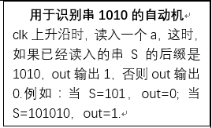

# Verilog FSM 设计流程
## 设计流程
对于状态机的概念和用法在理论课和前面部分的学习中接触到了很多，所以在此不再过多叙述。

在 Verilog HDL 中可以用许多种方法来描述有限状态机，最常用的方法是用 always 语句和 case 语句。下面具体说明用 Verilog 设计有限状态机的一般步骤：

1. 逻辑抽象，得出状态转换图。

2. 状态化简（该步骤可以省略），如果在状态转换图中出现两个一样的状态则需要将其合并为一个状态，以得到最简的状态转换图。

3. 状态分配，也就是状态编码。通常有很多种编码方式，比如 Gray 编码、独热编码等。在实际电路中，需综合考虑电路复杂度与电路性能之间的折中。这里的设计没有用到特别复杂的电路逻辑，所以大家可以自行决定用哪种编码方式。（不过，对于需要在FPGA上运行的电路，推荐使用 *独热编码* 方式。因为 FPGA 有丰富的寄存器资源，门逻辑相对缺乏，采用独热编码可以有效提高电路的速度和可靠性，也有利于提高器件资源的利用率。）

下面利用独热编码来介绍状态编码定义的两种方式：parameter 和 `define 语句。

* 用 `parameter` 参数定义： 用 n 个 `parameter` 常量表示 n 个状态，如下图所示：
  
      

* 用 `define 语句定义：用 n 个宏名表示 n 个状态，如下所示：

``` js
`define State1 4'b0001
 //不要加分号
`define State2 4'b0010
`define State3 4'b0100
`define State4 4'b1000
...

case (State)
    `State1:...;
    `State2:...;
    ...
endcase
```
1. 根据状态转移图得出次态逻辑和输出逻辑。

2. 按照相应逻辑，用 Verilog HDL 来描述有限状态机状态转移的情况。

* 复位时回到起始状态（敏感信号为时钟和复位信号，注意同步复位和异步复位的区别）
* 用 `case` 或 `if-else` 语句描述出状态的转移（根据现态（和输入）产生次态，可以与复位时回到起始状态的语句放在同一个 `always` 块中，即敏感信号为时钟和复位信号）
* 输出信号描述。用 `case` 语句或 `if-else` 语句描述状态机的输出信号

## 设计建议
下面给出设计的几点建议：

* 一般用case、casez 或 casex语句进行状态判断，比用 if-else 语句更加清晰明了。
* 在 case 语句的最后，要加上 default 分支语句，以避免锁存器的产生。
* 状态机一般应设计为同步方式，并由一个时钟信号来触发。
* 实用的状态机都应设计为由唯一的时钟边沿触发的同步运行方式。


# Verilog 状态机设计示例
## MOORE 型状态机设计示例
在上一节中，我们复习了 Verilog 状态机的设计流程。这一节我们以一个简单的状态机为例，解析如何全面地设计一个 Moore 型状态机。下面是一道简单的题目：

  

  


设计状态机的第一步，我们需要先分析问题，确定状态的**数量**和**定义**。

这道题我们需要设计一个识别 1010 的状态机。要确定它的状态数量，我们可能直觉认为要设置5种状态，分别处理读入了 ∅,1,10,101,1010 五种情况。这种想法是可行的，我们先根据这个直观的理解画出部分状态转换图，其中 state=0,1,2,3,4 分别对应“读入了∅,1,10,101,1010”。

  


显然，如果从零时刻开始，串行输入 1010 ，状态机会按照 state=0->1->2->3->4 的顺序转移，假如我们规定 out=1 当且仅当 state=4 ，那么状态机可以正确识别 1010 的串。问题是，当匹配到 101 时，如果读入了一个1，得到了 1011 ，我们该如何正确选择应该转移到哪个状态？为此，我们要用一种啰嗦的方式严格定义状态 statei 的意义。我们看到，所谓“读入了∅,1,10,101,1010”是一种很模糊的说法，它有歧义。例如字符流是 1010 ，我们该说“读入了10”，还是“读入了1010”呢？因此，原来的说法不是良好的定义，因为它不能单单根据字符流来确定究竟是哪个状态。

**定义**：设目标字符串 1010 为 str；状态机处于 statei 当且仅当：i>0, 设所有 1<=j<=4,`str[1:j]` 能匹配的输入字符流的后缀为 S，`str[1:i]` 匹配的输入字符流的后缀在 S 中最长; i=0, 当且仅当所有 1<=j<=4,`str[1:j]` 都不能匹配输入字符流的任何一个后缀。

`str[1:i]` 的意义是 str 第 1 个字符到第 i 个字符的部分，比如 `str[1:4]` 就是**1010**。通过这个定义，我们就可以很好地直接根据字符流确定是哪个状态。例如读入了 1010 时，显然 `str[1:2]`, `str[1:4]` 都可以匹配 1010 的后缀，前者对应 state2，后者对应 state4，然而后者匹配的后缀长度最长，因此我们确定这时应该是 state=state4。

这样的定义是有好处的，有了它，我们就可以根据字符流判断是哪个状态。当然，这种状态的正确性的维护有赖于状态转移函数的选择。如果状态转移函数胡乱规定，我们就无法确定状态的正确性。

  


在这里，我们采用类似于动态规划的思路规划状态转移函数。思路是：每在状态之间加入一条或几条表示状态转移的边，都要保证这样的操作能维持一个**性质**——在外界输入保证变换只涉及当前已经加入的边的条件下，涉及到的状态不违背我们事先约定的定义。

现在我们有四条边，我们考虑在这四条边上进行状态转移的情况。初始状态为 state=0。显然要走到4，只有一条路径0->1->2->3->4，对应输入1010。state=0 时，我们回顾**定义**，输入的字符流是∅，这时谁也匹配不了，我们保持了状态定义的正确性；state=1，输入的字符流是1，str[1:i],i=1 能匹配最长的后缀，而别的 str[1:j] 都不能匹配，我们再次保持了状态定义的正确性……接下来你可以自己推导，我们初步的状态转移设置确实维护了**定义的正确性**。

接下来，我们要补全状态转换图。当前的状态转换图是不完整的，我们在维持定义正确性的前提下补全每个状态下 0,1 两种输入对应的状态转移后，就得到了完整的正确的状态转换图。

首先从 state=0 开始考虑，我们欠缺了输入为 0 的情况。我们尝试加入一条边，再验证它的正确性。

  

首先，我们根据前面的分析，知道假如状态转移只走之前加过的边，状态的定义是被保持的。现在我们考虑经过新加边的情况。当 state=0，对任意 1<=j<=4，输入字符流的末尾没有一个符合 str[1:j]，新加边表示我们又读入了一个 0，显然还是没有 statej 来匹配输入字符流的后缀。因此新加边没有影响定义的正确性。

接着我们看 state=1。我们像上面一样，添加一个状态转移边并分析正确性。

  


回顾定义，state=1时，字符串"1"即 str[1:1] 匹配的输入字符流的后缀在所有状态中最长的。隐含的意思是，我们不需要考虑输入字符流的后缀有什么“101”的情况。这时我们读入了一个字符 1，那么输入字符流的一个后缀是 11，我们扫遍所有的 statej，发现还是 state1 匹配的后缀最长，因此要保持在 state=1。我们再次维护了上述的定义的正确性。

以此类推，我们容易得到正确的状态转移图：

  


最后，把状态转换图改写成对应的 Verilog 程序，并注意根据 state 维护 out 的值，我们就成功实现了一个能正确识别1010串的 Moore 型有限状态机。

  


# Verilog 模块代码样例
## 小型通用模板
这一节主要给出笔者个人对于不同需求的代码样例，供大家参考。

### MUX

``` js
assign result = (Aluop == 4'd0) ? (srca + srcb) :
                   (Aluop == 4'd1) ? (srca - srcb) :
                   (Aluop == 4'd2) ? (srca & srcb) :
                   (Aluop == 4'd3) ? (srca | srcb) :
                   (Aluop == 4'd4) ? (srca ^ srcb) :
                   (Aluop == 4'd5) ? (srca > srcb) :
                   32'd0;
```
如果涉及有符号数的运算，不推荐使用**三目运算符**，推荐使用 `always@(*)` 的方式，一般来说 `always@(*)` 配合 `case` 写出的类似 **MUX** 语句在仿真中的行为类似纯组合逻辑，但是 `result` 在写代码时应写为reg型。

``` js
always @(*) begin
      case(Aluop)
        4'd0:begin
            result = srca + srcb;
        end
        4'd1:begin
            result = srca - srcb;
        end
        4'd2:begin
            result = srca & srcb;
        end
        4'd3:begin
            result = srca | srcb;
        end
        4'd4:begin
            result = srca ^ srcb;
        end
        4'd5:begin
            result = srca > srcb;
        end
    endcase
  end
```
### 流水线寄存器（P5）

``` js
module pipeline_sample(
   input clk,
   input reset,
   input stall,
   input flush,
   input [31:0] aluResultAtExe,
   //可能还有其他来自前一级的输入
   output [31:0] aluResultAtMemory
   //可能还有要输出到后一级的
   //输入输出应配对
   );
   //根据端口定义，可能还要开其他的临时寄存器
   reg [31:0] aluResult;
   //根据临时寄存器的值，可能还要连其他的线
   assign aluResultAtMemory = aluResult;

   always @(posedge clk)
   //可能还要处理其他的临时寄存器
   begin
       // 复位 或者 清除流水线寄存器（阻塞，异常中断处理会用到）
       if(reset | flush)
       begin
           aluResult <= 32'd0;
       end
       else begin
           //判定是否应阻塞该级，不阻塞时才更新为前一级的值
           if(!stall)
           begin
               aluResult <= aluResultAtExe;
           end
       end
   end

endmodule
```

# Verilog 代码规范
本文档是推荐的 Verilog 编程规范，遵守本规范可以减少你代码中出现的问题，避免在“莫名其妙”的问题上浪费时间。本规范修改自 `thu-cs-lab/verilog-coding-standard`。

## VC-001  信号名称采用 snake_case
信号名称通常采用 `snake_case`，即变量名全小写，单词之间用下划线分隔。

## VC-002 信号极性为低有效用 _n 后缀表示
对于复位和使能信号，例如 `rst` 和 `we`，如果添加了 `_n` 后缀，表示值为零时生效（低有效，Active Low），值为一时不生效；如果没有添加 `_n` 后缀，表示值为一时生效（高有效，Active High），值为零时不生效。详细解释见下面的表格：

|信号名称|极性	|1'b1	|1'b0|
| :---: | :---: | :---: | :---: |
|rst	|高有效	|复位	|不复位|
|rst_n	|低有效	|不复位	|复位|
|we	|高有效	|写入	|不写入|
|we_n	|低有效|	不写入|	写入|

当代码中需要混合使用 rst 和 rst_n 的时候，采用以下的方式来转换：
``` js
module test(
  input rst_n
);
  wire rst;

  // GOOD
  assign rst = ~rst_n;

  // GOOD
  // Verilog
  always @(*) begin
    rst = ~rst_n;
  end

endmodule
```

## VC-003 信号仅在一个 always 块中赋值
通常情况下，一个信号只会在一个 `always` 块中赋值。

## VC-004 组合逻辑采用 `always @(*)` 块或者 `assign` 编写
组合逻辑的 `always` 块，使用以下的写法：

``` js
// Verilog
always @(*) begin
  c = a + b;
end

// GOOD
assign c = a + b;
```
## VC-005 组合逻辑 always 块中仅使用阻塞赋值
表示组合逻辑的 `always` 块中所有的赋值请使用阻塞赋值` = `。

## VC-006 组合逻辑 always 块中保证每个分支都进行赋值
如果使用了条件语句 `if`，需要保证信号在每个可能的分支途径下都进行了赋值。

``` js
// GOOD
always @(*) begin
  if (reset_n) begin
    c = a + b;
  end 
  else begin
    c = 1'b0;
  end
end

// BAD
always @(*) begin
  if (reset_n) begin
    c = a + b;
  end
end
```
请不要列举敏感信号：

``` js
// BAD
always @ (b, c) begin
  a = b + c;
end
```

## VC-007 时序逻辑在 `always @(posedge clock)` 中实现
当需要表示时序逻辑时，使用以下的写法：

``` js
// Verilog
always @(posedge clock) begin
  c <= a + b;
end
```
## VC-008 时序逻辑 `always` 块中仅使用非阻塞赋值
时序逻辑 `always` 块中，所有的赋值请使用非阻塞赋值 `<=` 。

## VC-009 不要使用下降沿触发，特殊协议除外
通常情况下，请不要使用下降沿触发：
``` js
// BAD: do not use negedge
always @ (negedge clock) begin
end
```
## VC-010 不要使用非时钟 / 复位信号的边沿触发
通常情况下，不要使用除了时钟和复位以外的信号做边沿触发。

``` js
// BAD: do not use non-clock/reset signals
always @ (posedge signal) begin
end
```
## VC-011 时序逻辑中不要使用时钟信号
在时序逻辑中，请不要在敏感列表以外的地方使用时钟信号：

``` js
// BAD
always @ (posedge clock) begin
  if (clock) begin
    a <= 1;
  end
end
```

## VC-012 使用同步复位，而不是异步复位
对于 FPGA，请使用同步复位：

``` js
// Verilog
always @(posedge clock) begin
  if (reset) begin
    c <= 1'b0;
  end else begin
    c <= a + b;
  end
end
```
## VC-013 不要在内部模块中使用 `inout`
FPGA 内部的模块之间请不要使用 inout，仿真环境除外。

## VC-014 用 `localparam` OO命名状态机的各个状态
编写状态机的时候，用 localparam 命名各个状态：

``` js
// GOOD
localparam sInit = 2'd0;
localparam sIdle = 2'd1;
localparam sWork = 2'd2;
localparam sDone = 2'd3;

reg [1:0] state;
```
如果仿真工具不支持在波形中显示为对应的状态名称，可以采用以下的方法：

``` js
`ifndef SYNTHESIS
  reg [39:0] state_string; // 40 bits = 5 byte

  always @ (*) begin
    case(state)
      sInit: state_string = "sInit";
      sIdle: state_string = "sIdle";
      sWork: state_string = "sWork";
      sDone: state_string = "sDone";
      default: state_string = "?????";
    endcase
  end
`endif
```
此时在仿真波形中，state_string 信号就可以看到状态的名称了。

-------
## 其他可参考的 Verilog 编程规范
* 数字逻辑设计实验文档
 https://d.buaa.edu.cn/https/77726476706e69737468656265737421fcf643d2242326446d0187ab9040227b6b5e69df18fd/digital-design/doc/
* Verilog Coding Standard
  https://d.buaa.edu.cn/http/77726476706e69737468656265737421f6e7469d24207d1e7d09/fpga/verilog.html
* lowRISC Verilog Coding Style
  https://d.buaa.edu.cn/https/77726476706e69737468656265737421f7fe5594323226537105/lowRISC/style-guides/blob/master/VerilogCodingStyle.md


# 初窥P4：大型状态机的分解与封装
### 大型状态机的分解与封装，内部模块分类（初窥 P4）
* 对于一个单周期 CPU 级别的大型状态机，内部应包含大致三类模块：
  * 基本状态机模块，如 GRF，IF，DM 等等
  * 基本组合逻辑模块，如 NPC，ALU，xxCtrl 等等
  * 连线模块，如 DataPath，globalCtrl 等等
* 基本状态机模块
  * 执行一个基本的，高内聚低耦合的状态转移和状态保存。
  * 何为高内聚低耦合？以 GRF 为例：
  * 每一个状态部件（某一个通用寄存器）对于内部状态都很重要，输出需要综合考虑所有的状态
  * 输入和输出很简洁，接口少，外界可以半黑盒调用
* 基本组合逻辑模块
  * 执行一个比较复杂，并且因为内聚耦合因素，无法放入某一个状态模块的大段组合逻辑
  * 以 ALU 举例，内部计算类型和 Mux 繁多，但端口也很简洁
  * 以 NPC 举例，可仿照之前的分析自行探索 NPC 模块封装的重要意义
* 连线模块
  * 当各种基本模块都建模完毕的时候，要利用一个连线模块将各种模块的端口进行连接。这一部分强烈推荐没有阅读之前教程中 ISE 实例化模板的同学仔细阅读那一部分。这个功能的作用是根据已有模块自动生成调用模板，就像 testbench 那样。
  * 连线模块在 P5 之后会遇到端口太多的问题。因此在初次建模的时候，就推荐同学们采用良好的端口命名，尽量避免同名端口（比如 readData）和无意义端口（output [7:0] outputValue)，尽可能尽快形成一套命名规范。一套良好的底层规范是在大规模建模中保持清醒的前提。