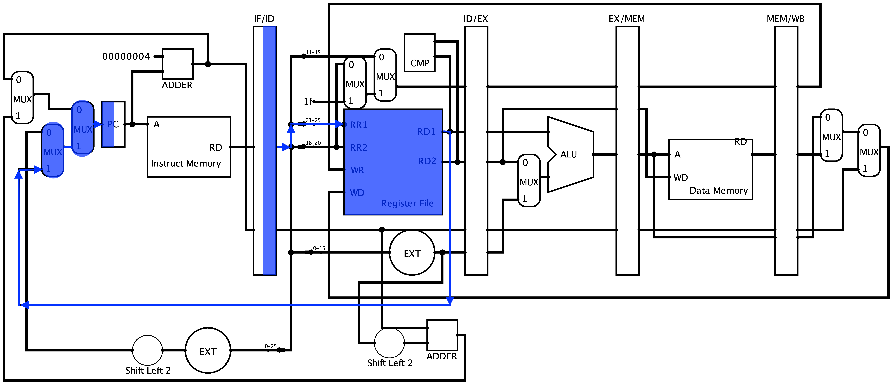

# **前言**
本部分流水线工程化设计方法教程，主要是由高小鹏老师的相关讲义，结合往届同学的相关经验总结而成，旨在帮助同学们顺利地完成流水线 CPU 的设计。

1. 教程将首先从构建不处理冒险的数据通路入手，完成数据通路和控制信号的搭建。
2. 其次，教程将理论性的分析各类冒险的成因，如何利用阻塞和转发机制，在不损失太多性能的前提下处理冒险。
3. 然后，教程将介绍如何利用 AT 方法快速、鲁棒的构建转发和暂停的机制。同时，AT 方法的核心思想也可以用于后续其他机制的构建
4. 最后，教程将从代码编写的角度出发，介绍如何以工程设计风格来完成代码编写，在增加可读性的同时降低调试、增量开发的难度
5. 此外，教程还将介绍一些调试方法，帮助大家了解 bug 复现-bug 定位-bug 修正的方法。教程还简要介绍了自行搭建自动化测试环境的流程，供同学参考


# **前期准备与指导原则**
从 P5 开始的 CPU 将是具有一定代码规模（500-2000 行、因人而异）的工程，并将在 P6-P8 中进行增量开发。实现起来需要对各环节、各模块始终保持的全局掌握，在调试或增量开发时能够迅速定位具体细节。开发这类工程需要注意如下问题：

1. **先写实验报告。** 撰写实验报告的过程，实际就是思考实验任务，整理明确自己的设计思路，并把自己的设计结构完全定型的过程。如果在思路没有完全定型的情况下就贸然开始写代码，非常容易遇到的问题是：在编码过程中发现某些新的问题需要解决，或者遗忘或记错了某个设计细节。尤其容易出现混淆的就是各个控制信号的和数据端口的设计，这样细小的问题极难查出。预先把 `模块功能` 、 `结构设计` 、 `端口定义` 、 `控制信号命名` 都整理清楚，则可以大大减少此类无谓 BUG 发生的可能性。

2. **规范化命名。** 在流水线 `CPU` 设计中，不可避免地会出现大量的端口和用来在端口中传输数据的 `wire` 变量，以及由各流水级部件产生的大量数据端口，如何给它 们命名是一个重要的问题。虽然命名方式各有习惯，但是有一些原则是可以明确的。对于数据信号，明确指出信号名、阶段名、方向。这一部分的细节将在后面的“工程设计风格”一节进行详细介绍。

3. **模块化结构。** 把每一个流水级作为一个独立模块，每一级流水线寄存器也作为一个独立模块，数据只能在相邻模块之间传递。有的同学把所有模块一起放在 `mips` 顶层文件里，这固然是没有错的，但是由于各级的数据线路和信号混杂在一起，修改或增减某个端口，会有一连串的连带修改端口，给代码的修改带来极大的风险。 **把每个流水级设计为独立模块** ，可以把流水级内和流水级间的数据通路清楚分开，在一定程度上预防这个问题。


# **构建数据通路**
在我们设计 `CPU` 之前，需要明确对 `CPU` 中数据通路的设计和实现，良好的设计方法和实现步骤，将会帮助我们更好理解流水线处理器的工作原理，更好地完成流水线工程化方法的实现。

## **数据通路的五个阶段**

  

我们的 CPU 为五级流水线设计，因此一共有五个主要阶段，分别为：

1. 取指 - `IF`: 取指, PC 自增

2. 译码和读寄存器 - `ID`: 译码, 读寄存器

3. 执行 - `EX`: 执行( ALU )

    Lw/Sw 指令: 计算内存指针

    其他指令: 执行其他算术和逻辑运算

4. 访存 - `Mem`:

    Lw: 从内存读数据到 CPU 寄存器

    Sw: 把寄存器的值写到内存中

5. 回写 - `WB`: 把数据写回到寄存器中

    对于 `add` 、`sub` 等指令，需要经过所有的五个阶段才能完成整个指令的工作，对于 `sw` 等指令，仅仅到达访存 `M` 阶段就已经结束，而对于 `beq` 等指令，在执行 `EX` 阶段完成 `PC` 更新后，就不再有具体的工作了。在我们之后一步步的指令分析中，将带领大家分析这些指令，并根据需求建立我们的数据通路。

## **流水线寄存器**

  


流水线寄存器的命名规则为：前级/后级，数据通路的流水化离不开寄存器的巨大作用，我们通过在两个阶段之间加入寄存器，来保存在前一周期中的上一阶段所传来的数据，同时在后一周期中为下一阶段提供数据。无论是数据还是信号，都需要在寄存器中进行保存，直至不再需要。

五级流水线处理器需要有五个流水线寄存器，在图中可以看到在 `IF` 和 `ID` 阶段之间的 `IF/ID` 流水线寄存器，在 `ID` 和 `EX` 阶段之间的 `ID/EX` 流水线寄存器，在 `EX` 和 `MEM` 阶段之间的 `EX/MEM` 流水线寄存器，在 `MEM` 和 `WB` 阶段之间的 `MEM/WB` 流水线寄存器。然而似乎少了保存 `WB` 阶段的流水线寄存器，由于写回 WB 阶段的作用正式将数据写入寄存器堆 `RF` 中，因此，`RF` 可以看作是一个流水线寄存器。至此，我们拥有了五个流水线寄存器。

## **数据通路的构造 —— 指令分析**
这是我们在 `P5` 中需要实现的指令集 MIPS-lite2={ `addu`, `subu`, `ori`, `lw`, `sw`, `beq`, `lui`, `j`, `jal`, `jr`, `nop` }，这些指令基本覆盖了我们的处理器需要实现的整个数据通路，因此，将根据对他们的分析带领大家建立起我们的数据通路。

### **简单的 `R` 型算术运算指令：`addu` 、`subu`**
1. `IF`：从 `PC` 寄存器取地址，根据地址从 `IM` 中获得指令编码，在下一周期存入 `IF/ID` 寄存器中。

      


2. `ID`：从 `IF/ID` 寄存器取出指令，根据相应寄存器 `rs`、`rt` 地址获取其中数据，与 `rd` 地址一起在下一周期存入 `ID/EX` 寄存器中。

      


3. `EX`：从 `ID/EX` 寄存器获得上一阶段从 `RF` 中取得的值，经过 `ALU` 计算，下一周期将存入 `EX/MEM` 寄存器中，`rd` 地址继续流水。

      


4. `MEM`：`rd` 地址与 `ALU` 结果继续流水。

      


5. `WB`：`MEM/WB` 寄存器为 `RF` 提供 `rd` 地址与 `WD`，将相应数据写入 `rd` 中。

      


### **带有立即数的 `I` 型算数、逻辑运算指令：`ori`、`lui`**
这类指令与之前的 `R` 型算数、逻辑运算指令大致相似，不同之处在于 `ID` 和 `EX` 阶段的处理。

1. `ID`：将指令低 `16` 位取出经过 `EXT` 存入 `ID/EX` 寄存器。

      


2. `EX`：`ID/EX` 提供 `EXT` 的结果，经过多路选择器提供给 `ALU` 的 `B` 端。

      


### **内存访问指令：`lw`**
访存时写入寄存器变为 `rt`，需要在 `ID` 级增加一个 `MUX`，同时，在 `MEM` 级需要 `ALU` 的输出来指定 `DM` 的地址获得数据，这个数据随着流水线传到 `WB` 阶段写入 `RF`，因此在 `WB` 需要增设一个 `MUX`。

1. `ID`

      


2. `MEM`

      

3. `WB`

      


### **内存写入指令：`sw`**
内存的写入在 `MEM` 级需要增加为 `DM` 提供的写入数据，并且在 `WB` 阶段没有实质性的数据通路，即无需写回到 `RF`。

1.  `EX`

      

**
2. `MEM`

      


### **跳转 `B` 型指令：`beq`**
在分析跳转指令开始之前，我们首先需要考虑 `PC` 寄存器，在之前的指令分析中我们一直没有对他进行思考，由于指令是顺序执行的，因此我们需要不断为 `PC` 寄存器加 `4`，如图：

  


完善 `PC` 寄存器的实现后，我们开始正式分析 `beq` 这个指令，`beq` 需要在取出 `rs` 、`rt` 寄存器的值后进行比较，然后决定是否跳转到新的 `PC` 值，新的 `PC` 的值可以通过 `ID` 级有符号扩展后，左移两位，再与 `PC+4` 相加得到。

1. `ID`

      

### **跳转 `J` 型指令：`j`、`jal`**
`J`型跳转指令同样无条件的可以在 `ID` 级就修改 `PC` 寄存器的值，但需要在 `ID` 级增加一个扩展 `26` 位立即数的部件，同时，`jal` 需要写入 `ra` 寄存器，`PC+8` 的值需要流水至 `WB` 级写入 `RF`。

1. `ID`

      


2. `EX`

      


3. `MEM`

      


4. `WB`

      


### **跳转 `R` 型指令：`jr`**
`R` 型跳转指令将 `rs` 写入 `PC` 寄存器，可以在 `ID` 级就修改 `PC` 寄存器，因此只需在 `ID` 级增加一个 `MUX`。

1. `ID`




# **流水线冒险**
之前我们已经讨论了不考虑冒险的情况下，数据通路的构造方法。这部分虽然工作量大，但是相对而言并不复杂。接下来，我们将从理论分析和工程实现两方面对冒险进行分析，并对转发和阻塞机制进行介绍。

在流水线 CPU 中，所谓冒险（ `Hazard` ），就是指由于指令间存在相关性或依赖相同的部件，导致两条指令无法在相邻的时钟周期内相继执行的情况。冒险的类型，主要有 **结构冒险**（ `Structural Hazard` ）、**控制冒险**（ `Control Hazard` ）和 **数据冒险**（ `Data Hazard` ）三种。

在本节接下来的内容中，将对 **结构冒险** 和 **控制冒险** 以及它们的应对方法作一简要介绍。 **数据冒险** 则留待下一节介绍。

## **结构冒险**
结构冒险是指 **不同指令同时需要使用同一资源的情况** 。例如在*普林斯顿结构* 中，指令存储器和数据存储器是同一存储器，在取指阶段和存储阶段都需要使用这个存储器，这时便产生了结构冒险。我们的实验采用*哈佛体系结构* ，将指令存储器和数据存储器分开（这种做法类似于现代 CPU 中指令和数据分离的 L1 Cache），因此不存在这种结构冒险。

另一种结构冒险主要在于 **寄存器文件需要在 D 级和 W 级同时被使用（读写）**。由于我们 **使用分离的端口实现寄存器读写，并规定了读写同一寄存器时的行为**（见后面的教程），这种冒险也得以解决。

**综上所述，根据我们之前的设计，结构冒险无需进行特殊处理。**

## **控制冒险**
控制冒险，是指分支指令（如 `beq`）的判断结果会影响接下来指令的执行流的情况。在判断结果产生之前，我们无法预测分支是否会发生。然而，此时流水线还会继续取指，让后续指令进入流水线。对于这种情况，我们有什么办法解决呢？

+ 一个简单粗暴的解决办法是：**当分支指令进入流水线后，直接暂停取指操作，等待判断结果产生后再进行取指。** 这个做法的坏处也是显而易见的：如果判断结果在 `E` 级进行计算，我们需要等待分支指令进入 `E/M` 级寄存器中才可继续取指，这大大降低了流水线的执行效率。

+ 一个改进思路是：将比较过程提前，在 `D` 级读取寄存器后立即进行比较。尽早产生结果可以缩短因不确定而带来的开销。这也正是前一小节中，我们构造数据通路时所采用的思路（ `CMP` 模块）。

+ 此外，我们还可以将**暂停取指**的时间利用起来：**不论判断结果如何，我们都将执行分支或跳转指令的下一条指令。** 这也就是所谓的 **“延迟槽”** 。通过这种做法，我们可以利用编译调度，将适当的指令移入延迟槽中，充分利用流水线的性能。（注：延迟槽中的指令不能为分支或跳转指令，否则为未定义行为；对于 `jal` 指令，应当向 `31` 号寄存器写入当前指令的 `PC+8`。）

在我们的实验中，要求大家实现比较过程前移至 `D` 级，并采用 **延迟槽** 。
``` js
本节思考题:
​ 1. 在采用本节所述的控制冒险处理方式下，PC 的值应当如何被更新？请从数据通路和控制信号两方面进行说明。
​ 2. 对于 jal 等需要将指令地址写入寄存器的指令，为什么需要回写 PC+8？
```

# **数据冒险的分析**
几乎每一条指令，都需要获取一定的数据输入，然后某些指令还会产生数据输出。流水线之所以会产生数据冒险，就是因为 **后面指令需求的数据，正好就是前面指令供给的数据**，而**后面指令在需要使用数据时，前面供给的数据还没有存入寄存器堆，从而导致后面的指令不能正常地读取到正确的数据**。因此我们从 **需求数据** 和 **供给数据** 的行为来入手分析暂停、转发情况。

**需求者**：对于某条指令，实际上需求寄存器数据的是某些硬件部件。如，对于 `addu` 指令，需要数据的是位于流水线 `E` 级的 `ALU`，对于 `BEQ` 指令，需要数据的是位于流水线 `D` 级的比较器 `CMP`。而对于 `sw` 指令，需要数据的有 `EX` 级的 `ALU`（这个数据用来计算存储地址），还有 `MEM` 级的 `DM`（这里需要存入的具体的值）。

**供给者**：所有的供给者，都是存储了上一级传来的各种数据的 `流水级寄存器` ，而不是由 `ALU` 或者 `DM` 来提供数据。

分析清楚了数据的 **需求者** 和 **供给者** ，我们就可以理清处理数据冒险的策略了。假设当前我需要的数据，其实 **已经计算出来** ，只是还 **没有进入寄存器堆** ，那么我们可以用 **转发( Forwarding )** 来解决，即 **不引用寄存器堆的值** ，而是直接 **从后面的流水级的供给者把计算结果发送到前面流水级的需求者来引用** 。如果我们需要的数据还没有算出来。则我们就只能 **暂停( Stall )** ，让流水线停止工作，等到我们需要的数据计算完毕，再开始下面的工作。

那么，如何判断我们所需的数据是否已经计算出来了呢？我们为此提出一个简单高效的判定模型：**需求时间——供给时间模型** 。

###  **\* 对于某一个指令的某一个数据需求，我们定义需求时间 `Tuse` 为：这条指令位于 `D` 级的时候，再经过多少个时钟周期就必须要使用相应的数据。**


例如，对于 `BEQ` 指令，立刻就要使用数据，所以 `Tuse = 0`。

对于 `addu` 指令，等待下一个时钟周期它进入 `EX` 级才要使用数据，所以 `Tuse = 1`。

而对于 `sw` 指令，在 `EX` 级它需要 `GPR[rs]` 的数据来计算地址，在 `MEM` 级需要 `GPR[rt]` 来存入值，所以对于 `rs` 数据，它的 `Tuse_rs = 1`，对于 `rt` 数据，它的 `Tuse_rt = 2`。

在 `P5` 课下要求的指令集的条件下，`Tuse` 值有 **两个特点** ：

**特点 1：** 是一个定值，每个指令的 `Tuse` 是一定的

**特点 2：** 一个指令可以有两个 `Tuse` 值

###  **\* 对于某个指令的数据产出，我们定义供给时间 `Tnew` 为：位于某个流水级的某个指令，它经过多少个时钟周期可以算出结果并且存储到流水级寄存器里。**

例如，对于 `addu` 指令，当它处于 `EX` 级，此时结果还没有存储到流水级寄存器里，所以此时它的 `Tnew = 1`，而当它处于 `MEM` 或者 `WB` 级，此时结果已经写入了流水级寄存器，所以此时 `Tnew = 0` 。

在 `P5` 课下要求的指令集的条件下，`Tnew` 值有两个特点：

**特点 1：** 是一个动态值，每个指令处于流水线不同阶段有不同的 Tnew 值

**特点 2：** 一个指令在一个时刻只会有一个 `Tnew` 值（一个指令只有一个结果）
当两条指令发生数据冲突（前面指令的写入寄存器，等于后面指令的读取寄存器），我们就可以根据 `Tnew` 和 `Tuse` 值来判断策略。


1. `Tnew = 0`，说明结果已经算出，如果指令处于 `WB` 级，则可以通过寄存器的内部转发设计解决，不需要任何操作。如果指令不处于 `WB` 级，则可以通过转发结果来解决。
2. `Tnew <= Tuse` ，说明需要的数据可以及时算出，可以通过转发结果来解决。
3. `Tnew > Tuse`，说明需要的数据不能及时算出，必须暂停流水线解决。
在不考虑暂停的条件下（认为不会有 `Tnew > Tuse` 的情况）下，我们可以利用转发机制处理所有冒险。在考虑暂停之后，将会对某些情况进行暂停，这些情况下将会 **停止取指**，同时插入 `nop` 指令，此时无论是原始读出的数据还是转发过来的数据，都不会被使用。因此，在下一节介绍实现 **转发与阻塞机制** 的时候，将首先 **无视阻塞实现转发机制** ，随后 **额外增加阻塞机制** ，即可正确地处理冒险。
``` js
本节思考题
为什么所有的供给者都是存储了上一级传来的各种数据的流水级寄存器，而不是由 ALU 或者 DM 等部件来提供数据？
```

# **`AT` 法处理流水线数据冒险**
在阅读本教程之前，同学们需要先阅读 CSCore `P5` 部分本节之前的所有小节，并对 **流水线 CPU 的冒险问题** 有一定的了解（如理论课中对流水线三类冒险的讲述、指令间数据相关性的分析等）。

经过计组课程团队的共同打磨，全新的 `AT` 法在今年终于和大家正式见面了。它不仅 **清晰易懂** ，而且 **开发简单** ，极大降低了出现 bug的概率和扩展需求的复杂度。下面，我们就来共同揭开 AT 法的神秘面纱。

## **何谓 `AT` ?**
`A` 指 `Address`，也就是`寄存器的地址（编号）`；`T` 指 `Time`，也就是前面所提到的 `Tuse` 和 `Tnew`。所谓 `AT` 法，就是指通过在 `D` 级对指令的 `AT` 信息进行 **译码并流水** ，就可以方便地构造出数据冒险的处理机制。

**“译码并流水”**：
+ 对于 `集中式译码` ，可以直接将译码信息流水；
+ 对于 `分布式译码` ，可以流水整个指令，并在需要时进行译码。下文中的“译码并流水”均为此意。

## **转发（旁路）机制的构造**
首先，我们 **假设所有的数据冒险均可通过转发解决** 。也就是说，当某一指令前进到必须使用某一寄存器的值的流水阶段时，这个寄存器的值一定已经产生，并 **存储于后续某个流水线寄存器中** 。

我们接下来分析需要 **转发的位点**。当某一部件需要使用 `GPR`（ `General Purpose Register` ）中的值时，如果此时这个值存在于后续某个流水线寄存器中，而还没来得及写入 `GPR`，我们就需要通过 `转发（旁路）机制` 将这个值从流水线寄存器中送到该部件的输入处。

**根据我们对数据通路的分析，这样的位点有：**

1. `D` 级比较器的两个输入（含 `NPC` 逻辑中寄存器值的输入）；
2. `E` 级 `ALU` 的两个输入；
3. `M` 级 `DM` 的输入。

为了实现转发机制，我们对这些输入前加上一个 `MUX`。这些 `MUX` 的默认输入来源是上一级中已经转发过的数据。
``` js
Thinking 1：如果不采用已经转发过的数据，而采用上一级中的原始数据，会出现怎样的问题？试列举指令序列说明这个问题。
```
下面，我们继续分析这些 MUX 的 **其他输入来源** 和 **选择信号的生成**。

`GPR` 是一个特殊的部件，它既可以视为 `D` 级的一个部件，也可以视为 `W` 级之后的流水线寄存器。基于这一特性，我们将对 `GPR` 采用 **内部转发机制** 。也就是说，当前 `GPR` 被写入的值会 **即时反馈到读取端上** 。
``` js
Thinking 2：我们为什么要对 GPR 采用内部转发机制？如果不采用内部转发机制，我们要怎样才能解决这种情况下的转发需求呢？
```

在对 `GPR` 采取 **内部转发机制** 后，这些 `MUX` 的其他输入来源就是这些 `MUX` 之后所有流水线寄存器中对 `GPR` 写入的、且对当前 `MUX` 的默认输入不可见的数据。具体来说，`D` 级 `MUX` 的其他输入来源是 `D/E` 和 `E/M` 级流水线寄存器中对 `GPR` 写入的数据。由于 `M/W` 级流水线寄存器中对 `GPR` 写入的数据可以通过 `GPR` 的内部转发机制而对 `D` 级 `MUX` 的默认输入可见，因此无需进行转发。对于其他流水级的转发 `MUX`，输入来源可以类比得出。

**选择信号的生成规则**是：

只要 **当前位点的读取寄存器地址** 和 **某转发输入来源的写入寄存器地址** 相等且不为 0，就选择该转发输入来源；
```js
 Thinking 3：为什么 0 号寄存器需要特殊处理？
 ```
在有多个转发输入来源都满足条件时，**最新产生的数据优先级最高**。
``` js
 Thinking 4：什么是“最新产生的数据”？
```
为了获取生成 **选择信号** 所需的信息，我们需要对指令的 **读取寄存器** 和 **写入寄存器** 在 `D` 级进行译码并流水（指令的“ `A` 信息”）。

如果同学们真正理解了上述构造规则，大家会发现：**转发机制核心逻辑的构造可以在短至 5 行代码内完成。**

## **暂停（阻塞）机制的构造**
接下来，我们来处理 **通过转发不能处理** 的数据冒险。在这种情况下，新的数据还未来得及产生。我们只能 **暂停流水线** ，等待新的数据产生。为了方便处理，本教程中所述暂停是指 **将指令暂停在 `D` 级**。

### **首先，我们来回顾一下 Tuse 和 Tnew 的定义：**

+ `Tuse`：指令进入 `D` 级后，其后的某个功能部件再经过多少时钟周期就必须要使用寄存器值。对于有两个操作数的指令，其每个操作数的 `Tuse` 值可能不等（如 `store` 型指令 `rs`、`rt` 的 `Tuse` 分别为 `1` 和 `2` ）。
+ `Tnew`：位于 `E` 级及其后各级的指令，再经过多少周期就能够产生要写入寄存器的结果。在我们目前的 `CPU` 中，`W` 级的指令 `Tnew` 恒为 `0`；对于同一条指令，`Tnew@M = max(Tnew@E - 1, 0)`。
那么，我们什么时候需要在 `D` 级暂停呢？根据 `Tuse` 和 `Tnew` 所提供的信息，我们容易得出：**当 `D` 级指令读取寄存器的地址与 `E` 级或 `M` 级的指令写入寄存器的地址相等且不为 0，且 `D` 级指令的 `Tuse` 小于对应 `E` 级或 `M` 级指令的 `Tnew` 时**，我们就需要在 `D` 级暂停指令。在其他情况下，数据冒险均可通过转发机制解决。

为了获取暂停机制所需的信息，我们还需要**对指令的 `Tuse` 和 `Tnew` 信息在 `D` 级进行译码，并将 `Tnew` 信息流水**（指令的“ `T` 信息”）。

将指令暂停在 `D` 级时，我们需要进行如下操作：

+ 冻结 `PC` 的值
+ 冻结 `F/D` 级流水线寄存器的值
+ 将 `D/E` 级流水线寄存器清零（这等价于插入了一个 `nop` 指令）
 
如此，我们就完成了暂停机制的构建。

## **思想延伸**
AT 法的一个关键操作就是 **将指令的关键信息提前进行译码并流水**。有了这些关键信息，我们就可以对指令的不同性质加以判断。在后续 Project 中，同学们也可能需要使用类似的思想或方法。

AT 法的核心思想是：**能让 A 和 T 做的，就让 A 和 T 来做。** 意思就是：既然只需要 A 和 T 便可以判断所有与转发、阻塞相关的事情，那就把 A 和 T 单独翻译出来，而不是用指令本身的 `op`、`rd`、`rs` 等乱七八糟的信号进行处理。教材或往届介绍的方法虽然功能正确，但将指令进行了分类，同时对 `rs`、`rt`、`rd` 甚至 31（有些指令固定写入 31 ）进行分析，十分复杂。

这类思想的核心就是，对于某个机制（如 `P5` 中的 **转发** 与 **阻塞** ，后面 `P7` 的 **异常进入** 与 **异常返回** ），首先设计出一些专门的信号（如 `P5` 中的 `A` 和 `T` ），确保这些信号足够且仅足够用于实现这一机制。随后，在合适的时间（如 `A` 和 `T` 位于 `D` 级）将其创建，在合适的条件下对其做可能的修改（ `P5` 课下的指令尚不需要对 `D` 级翻译出的 `A` 进行修改，对 `T` 的修改均为 **“ T 下一级 =max（ T 本级 -1，0）”**），之后仅利用这些信号便可生成“珍贵”的目标（如判断是否需要阻塞的 `stall` 信号，判断 `D` 级某寄存器真正值的 `mux` 选择信号）。

```
本节思考题
“转发（旁路）机制的构造”中的 Thinking 1-4；
在 AT 方法讨论转发条件的时候，只提到了“供给者需求者的 A 相同，且不为 0”，但在 CPU 写入 GRF 的时候，是有一个 we 信号来控制是否要写入的。为何在 AT 方法中不需要特判 we 呢？为了用且仅用 A 和 T 完成转发，在翻译出 A 的时候，要结合 we 做什么操作呢？
```